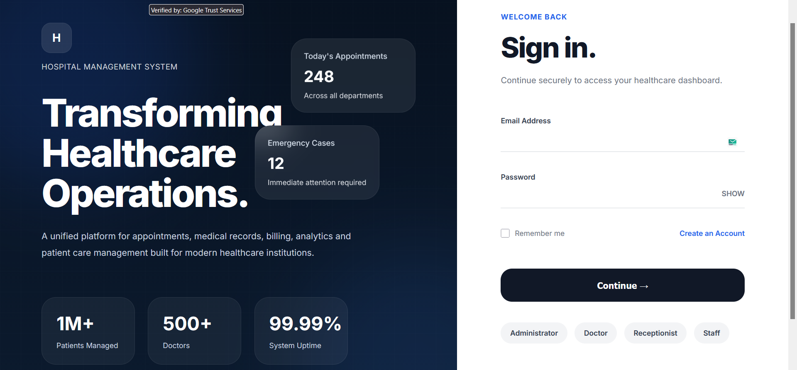
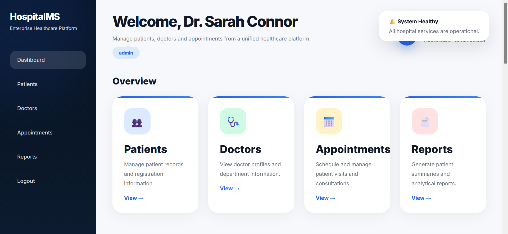
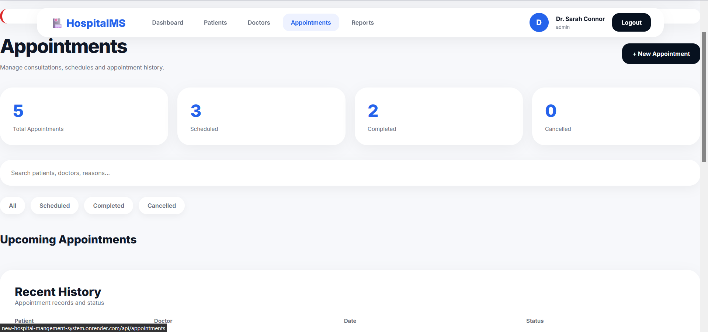
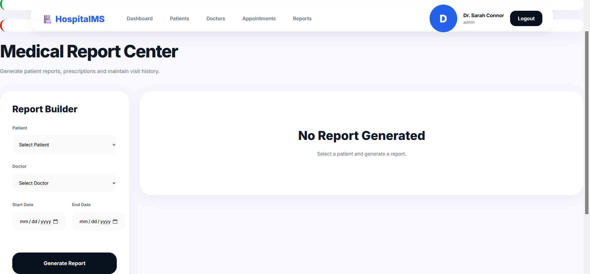

# 🏥 Hospital Management System

A full-scale, enterprise-grade Hospital Management System built with Node.js, Express, MongoDB, and EJS. Features patient appointment scheduling, medical records management, role-based authentication, and a custom report generation engine.

---

## 📋 Table of Contents

- [Features](#features)
- [Tech Stack](#tech-stack)
- [Live Demo](#live-demo)
- [Installation](#installation)
- [Environment Variables](#environment-variables)
- [Database Seeding](#database-seeding)
- [API Endpoints](#api-endpoints)
- [Screenshots](#screenshots)
- [Deployment](#deployment)
- [Future Improvements](#future-improvements)


---

## ✨ Features

### 🔐 Authentication & Authorization
- JWT-based authentication with secure cookie storage
- Role-based access control (Admin, Doctor, Receptionist, Patient)
- Login/Register with password hashing (bcrypt)
- Session management with flash messages

### 👨‍⚕️ Patient Management
- Full CRUD operations for patient records
- Search and filter functionality
- Emergency contact details
- Patient history tracking

### 👨‍🔬 Doctor Management
- Doctor profiles with specialization
- Availability scheduling
- Active/inactive status management

### 📅 Appointment Scheduling
- Book appointments with conflict detection
- Status tracking (Scheduled, Checked-in, Completed, Cancelled, No-show)
- View appointments by patient, doctor, or date

### 📋 Medical Records
- Comprehensive record keeping with diagnoses and prescriptions
- Prescription management (medicine, dosage, frequency, duration)
- Patient history timeline
- Visit notes and attachments

### 📊 Report Generation
- Custom report engine with MongoDB aggregation
- Patient summary reports with visit history
- PDF download functionality
- Filter by date range
- **Doctors can add new visit records directly from the report page**

### 🎨 UI/UX
- Responsive Bootstrap 5 design
- Role-based dashboards
- Flash messages for success/error notifications
- Patient portal for viewing personal appointments

---

## 🛠️ Tech Stack

| Category | Technology |
|----------|------------|
| **Backend** | Node.js, Express.js |
| **Database** | MongoDB, Mongoose ODM |
| **View Engine** | EJS (Embedded JavaScript) |
| **Authentication** | JWT, bcrypt, cookie-parser |
| **Styling** | Bootstrap 5, Font Awesome |
| **PDF Generation** | PDFKit |
| **Logging** | Morgan |
| **Deployment** | Render.com, MongoDB Atlas |

---

## 🌐 Live Demo

🔗 **Live URL:** [https://new-hospital-management-system.onrender.com](https://new-hospital-management-system.onrender.com)

### Test Credentials

| Role | Email | Password |
|------|-------|----------|
| **Admin** | `admin@hospital.com` | `admin123` |
| **Doctor** | `dr.connor@hospital.com` | `doctor123` |
| **Doctor** | `dr.house@hospital.com` | `doctor123` |
| **Receptionist** | `reception@hospital.com` | `reception123` |
| **Patient** | `john.patient@email.com` | `patient123` |

---

## 🚀 Installation

### Prerequisites
- Node.js (v14 or higher)
- MongoDB (local or Atlas)
- npm or yarn

### Steps

1. **Clone the repository**
```bash
git clone https://github.com/yourusername/hospital-management-system.git
cd hospital-management-system
```

2. **Install dependencies**
```bash
npm install
```

3. **Create `.env` file**
```bash
cp .env.example .env
```

4. **Configure environment variables**
```env
MONGODB_URI=mongodb://localhost:27017/hospital_db
JWT_SECRET=your_super_secret_key_here
SESSION_SECRET=another_secret_here
PORT=5000
```

5. **Seed the database** (optional - creates test data)
```bash
node seed.js
```

6. **Start the server**
```bash
npm start
# Or for development with auto-reload:
npm run dev
```

7. **Open your browser**
```
http://localhost:5000
```

---

## 🔧 Environment Variables

| Variable | Description | Required |
|----------|-------------|----------|
| `MONGODB_URI` | MongoDB connection string | ✅ Yes |
| `JWT_SECRET` | Secret for JWT token generation | ✅ Yes |
| `SESSION_SECRET` | Secret for express-session | ✅ Yes |
| `PORT` | Server port (default: 5000) | ❌ No |
| `NODE_ENV` | Environment (development/production) | ❌ No |

---

## 🗄️ Database Seeding

The `seed.js` script populates your database with test data including:

- 5 Users (admin, 2 doctors, receptionist, patient)
- 3 Doctors with availability schedules
- 4 Patients with full profiles
- 5 Appointments (past and future)
- 5 Medical Records with prescriptions

```bash
node seed.js
```

---

## 📡 API Endpoints

### Authentication
| Method | Endpoint | Description |
|--------|----------|-------------|
| GET | `/auth/login` | Login page |
| GET | `/auth/register` | Registration page |
| POST | `/auth/login` | Login user |
| POST | `/auth/register` | Register user |
| GET | `/auth/logout` | Logout user |

### Patients
| Method | Endpoint | Description |
|--------|----------|-------------|
| GET | `/api/patients` | Get all patients |
| GET | `/api/patients/:id` | Get patient by ID |
| POST | `/api/patients` | Create patient |
| PUT | `/api/patients/:id` | Update patient |
| DELETE | `/api/patients/:id` | Delete patient |

### Doctors
| Method | Endpoint | Description |
|--------|----------|-------------|
| GET | `/api/doctors` | Get all doctors |
| GET | `/api/doctors/:id` | Get doctor by ID |
| POST | `/api/doctors` | Create doctor |
| PUT | `/api/doctors/:id` | Update doctor |
| DELETE | `/api/doctors/:id` | Delete doctor |

### Appointments
| Method | Endpoint | Description |
|--------|----------|-------------|
| GET | `/api/appointments` | Get all appointments |
| GET | `/api/appointments/:id` | Get appointment by ID |
| POST | `/api/appointments` | Create appointment |
| PUT | `/api/appointments/:id` | Update appointment |
| PATCH | `/api/appointments/:id/cancel` | Cancel appointment |
| DELETE | `/api/appointments/:id` | Delete appointment |

### Medical Records
| Method | Endpoint | Description |
|--------|----------|-------------|
| GET | `/api/records` | Get all records |
| GET | `/api/records/patient/:patientId` | Get patient history |
| POST | `/api/records` | Create record |
| PUT | `/api/records/:id` | Update record |
| DELETE | `/api/records/:id` | Delete record |

### Reports
| Method | Endpoint | Description |
|--------|----------|-------------|
| GET | `/api/reports/generator` | Report generator page |
| GET | `/api/reports/patient` | Generate patient report |
| GET | `/api/reports/download` | Download PDF report |
| GET | `/api/reports/api/patient` | JSON report data |


---

## 📸 Screenshots

### Login Page


### Dashboard


### Appointment Booking


### Report Generator



---

## ☁️ Deployment

### Deploy to Render.com

1. Push your code to GitHub
2. Create a new Web Service on Render
3. Connect your repository
4. Configure environment variables
5. Deploy!

**Render Configuration:**
- **Build Command:** `npm install`
- **Start Command:** `node server.js`
- **Environment Variables:** MONGODB_URI, JWT_SECRET, SESSION_SECRET

### Deploy to Heroku

```bash
heroku create hospital-management
heroku config:set MONGODB_URI=your_atlas_uri
heroku config:set JWT_SECRET=your_secret
heroku config:set SESSION_SECRET=another_secret
git push heroku main
```

---

## 🔮 Future Improvements

- [ ] Email notifications (appointment reminders)
- [ ] File upload for medical records
- [ ] Advanced search and filters
- [ ] Calendar view for appointments
- [ ] Two-factor authentication
- [ ] Audit logs
- [ ] API rate limiting
- [ ] Redis caching
- [ ] Mobile app (React Native)

---

## 🤝 Contributing

1. Fork the repository
2. Create a feature branch (`git checkout -b feature/AmazingFeature`)
3. Commit your changes (`git commit -m 'Add some AmazingFeature'`)
4. Push to the branch (`git push origin feature/AmazingFeature`)
5. Open a Pull Request

---

## 👨‍💻 Author

**Your Name**
- GitHub: [@yourusername](https://github.com/p3anv)


---

## 🙏 Acknowledgments

- MongoDB Atlas for cloud database hosting
- Render.com for free deployment hosting
- Bootstrap for the UI framework
- All open-source libraries used in this project

---

## ⭐ Show Your Support

If this project helped you, please give it a ⭐ on GitHub!

---

**Built with ❤️ by Pranav**